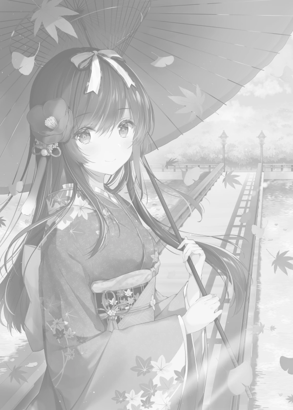

幻影坦克这个名字来源于游戏红警，没有玩过这款游戏，大概取其隐藏的意思吧。

# 原理

幻影坦克的核心原理是利用 PNG 图片的透明通道，根据不同背景显示不同颜色，
因此这里涉及到一个 **PNG 混色原理**。

> 以下假设各通道取值都是 $0-1$ 的浮点数。透明度 $\alpha$ 取 $0$ 表示完全透明，$1$ 表示完全不透明。

ref: <https://blog.csdn.net/m0_46555380/article/details/114301348>

PNG 图片的某一像素的亮度为 $L$ ，透明度为 $A$ ，则在背景亮度为 $L'$ 时，该像素显示的颜色为：
$LA+L'(1-A)$

> 该公式是「线性插值」算法，是常规的透明图像混合算法。

在纯白背景下 $L'=1$，则该像素显示的颜色为：
$LA+1-A$

在纯黑背景下 $L'=0$，则该像素显示的颜色为：
$LA$

现在有两张图片 X 和 Y，制作幻影坦克图片，要求在白色背景下显示 X，在黑色背景下显示 Y。假设两张图片尺寸相同。

根据混色原理，我们可以得到：

$$
\left\{
\begin{aligned}
    L_X&=LA+1-A \\
    L_Y&=LA
\end{aligned}
\right.
$$

解方程可以得到

$$
\left\{
\begin{aligned}
    A&=1-(L_X-L_Y) \\
    L&=\frac{L_Y}{A}
\end{aligned}
\right.
$$

通过该式可以计算新图片的每个像素的亮度 $L$ 和透明度 $A$。

由于像素取值范围为 $0-1$，通常需要对图片做预处理，一般将
X 颜色调亮，Y 颜色调暗，使得两张图片的亮度差异尽可能大。

$$
\begin{aligned}
L_X'&=L_X/2+0.5 \\
L_Y'&=L_Y/2
\end{aligned}
$$

计算机中像素取值范围为 $0-255$，需要将 $0-1$ 映射到 $0-255$。

图像尺寸问题：
不同尺寸的图片可以重采样使得长或宽至少一个维度相等；也可以填充纯白（X）或黑色像素（Y）使得长或宽相等，原始图片居中。

# 实现

其他细节自己注意，具体实现不再展示。

# 展示

> 试试开/关灯

