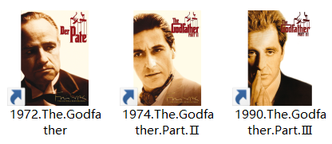
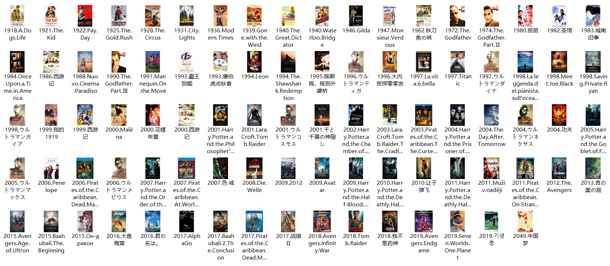
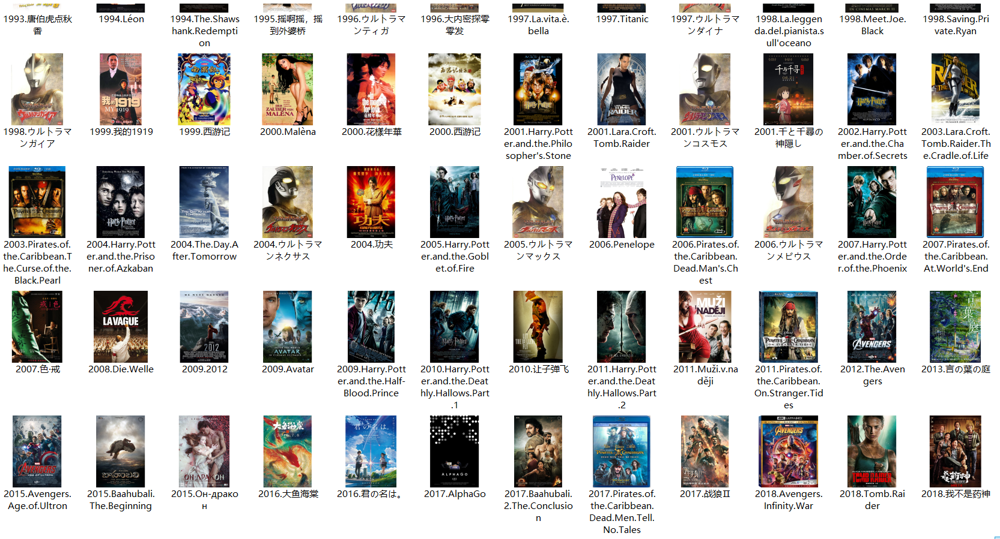
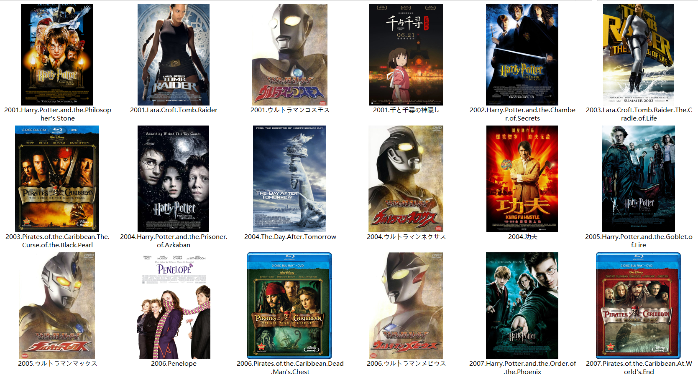
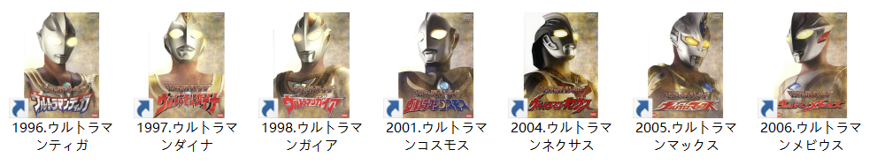
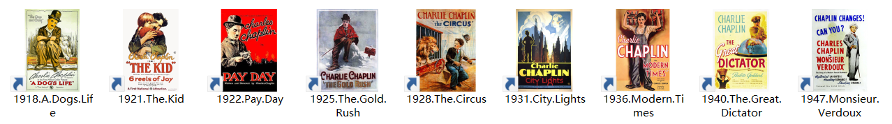
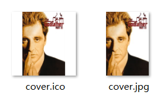

+++
title = '收藏电影方法'
date = 2023-06-20T14:27:01+08:00
tags = ['film', 'collection']
categories = 'film'
+++

起初是看了几部很棒的电影，时时回味，就把它们下载下来了。一直放在“下载”文件夹，与其它文件混作一团。

看电影对我而言真的是一种生活方式，有 "escape this town for a little while" 的惬意。
积累了十几部后，电脑的硬盘有些吃不消了，于是转到移动硬盘。（先是 2.5 寸硬盘，后来这块硬盘作它用，另购一块 3.5 寸硬盘加硬盘盒，有盖房子的红砖那么大，3.5 寸盘现在专门装影视。）
收藏的所有电影都放在硬盘里，没有备份，都是心血之作，一定要倍加爱惜，轻拿稳放。
影视管理也是一门学问，网友提供了很多方案，也有很多管理软件，都不合我意。在折腾许久之后，自己总结一套方案，核心内容就八个字：**宁缺毋滥、简胜于繁**。

依我的影视理解，一部电影不只是一个 mkv 文件，还有一系列相关的内容，包括海报、音乐、花絮等，影视管理软件根本不合适，而且花里胡哨，令人眼花缭乱。另外，作为个人收藏，电影一定是触动内心、令人印象深刻的，那些只能看一遍的电影就没必要费心思了，留下来的应都是精品。

考虑到电影分类繁杂，有些电影还可以放入多个分类，我借鉴了数据库分表方式来分类管理。
首先建立一个根文件夹，存放所有电影，电影文件夹命名为“上映年份+电影名”，电影名要用原名，非法字符和空格用点代替，例如 1990 年上映的《教父3》 `The Godfather: Part III`，命名为 `1990.The.Godfather.Part.III` 。

*网友提供了一个思路，将电影文件夹封面替换为海报，作为一个美观又不麻烦的装饰。方法后讲。*

然后另建一个文件夹，存放系列、分类。将第一个文件夹里成系列、成类别的电影创建快捷方式，放在第二个文件夹里，快捷方式也带有海报图片，看起来很整齐。例如三部《教父》，新建文件夹，命名为“教父三部曲”，将三部教父的快捷方式放入其中



如果不喜欢快捷方式的箭头，也有方法去掉。《教父》系列也可以放入“欧美电影”系列，只需复制一份快捷方式，就实现了交叉分类。

目前收藏了 80+ 的影视，每次打开都很有满足感



放大看



再大



喜欢的平成奥特曼



卓别林电影



……

---

下面讲讲怎么制作电影封面。

基本方法是：`右键文件夹->属性->自定义->更改图标->浏览`，找到并选择心仪的海报图标文件（icon 文
件，后缀 .ico）。

制作合适的 icon 文件也有讲究，海报图片一般来自豆瓣或者 imdb，是长方形的 jpg 或者 png。有专门制作 icon 的软件和在线工具，如果会编程可以自己写一个。

需要注意的是 icon 文件要放在固定位置，最好与电影放在一起，都放在移动硬盘上，不然移动或删除会失效。还有一点，要用正方形图片制作海报，否则会变形，如果是长方形就先填充透明像素。

高级方法是弄清文件夹图标的原理，写一个脚本批量处理。

网上关于 icon 的介绍很少，或者模糊不清，文件夹图标更不用说了，千篇一律的抄袭文章。经过自己一番探索，发现 Windows 文件图标的原理包括三个关键点：

- icon 文件
- desktop.ini 文件
- 文件夹只读属性

于是做以下约定：

在电影文件夹里新建一个名为 poster 的文件夹，在 poster 里存放名为 cover.* 的图片文件（即 cover.jpg、cover.png 等，一张足矣）。

编写 Python 脚本，输入电影文件夹路径，自动读取 poster 文件夹及其中的 cover 文件，在 poster 下生成 cover.ico 文件。在电影文件夹下创建 desktop.ini 文件，写入配置，设置“系统”、“隐藏”属性。给电影文件夹设置“只读”属性。



```ini
[.ShellClassInfo]
IconResource=poster\cover.ico,0
```

经过测试， perfect ！

另外一些脚本细节不再赘述，包括通配符批量设置，过滤器避免重复等。

完整项目 [anemele/make-film-cover](https://github.com/anemele/make-film-cover)
